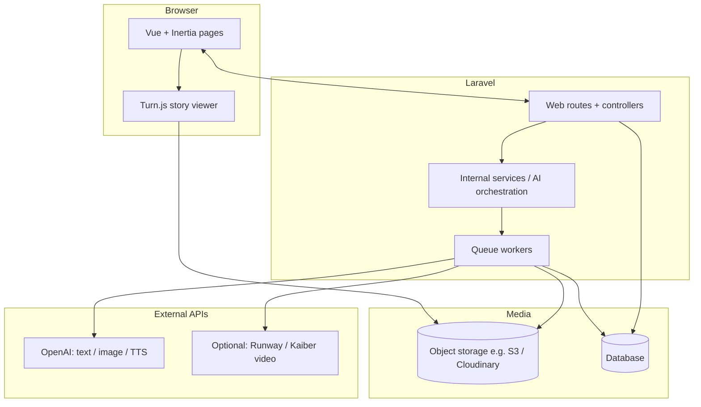
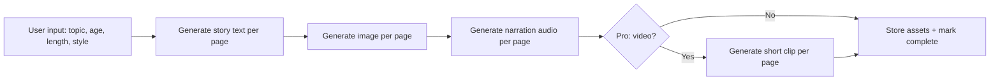
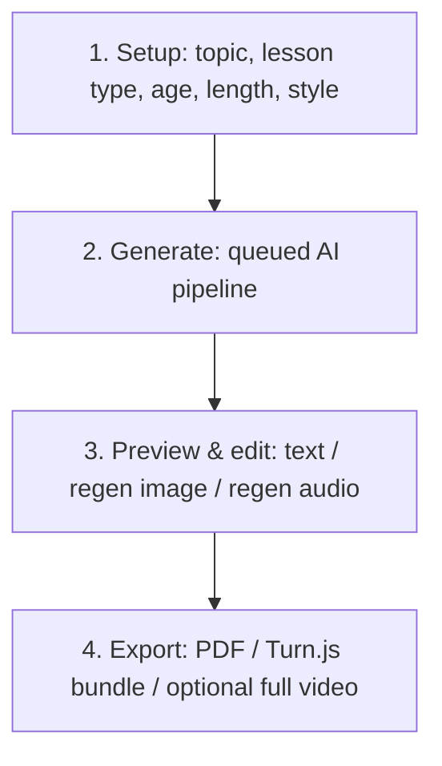
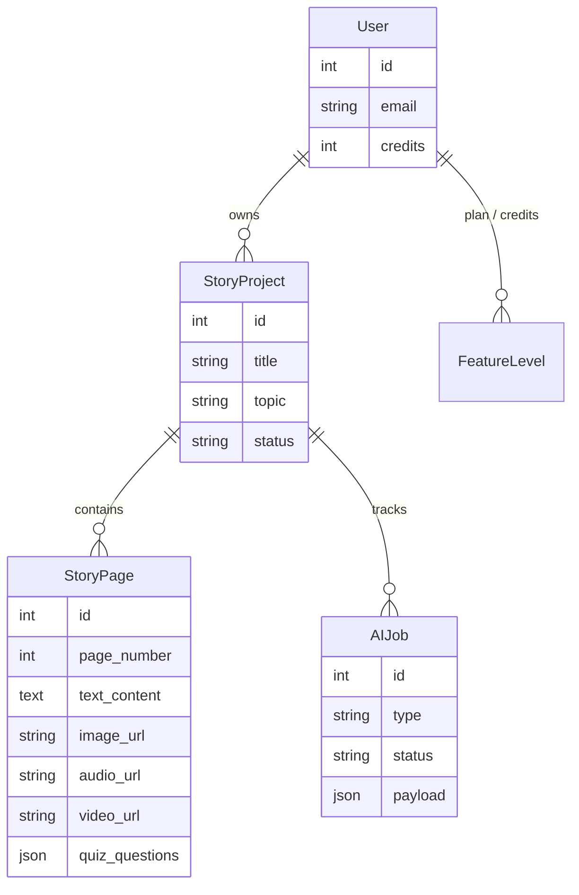
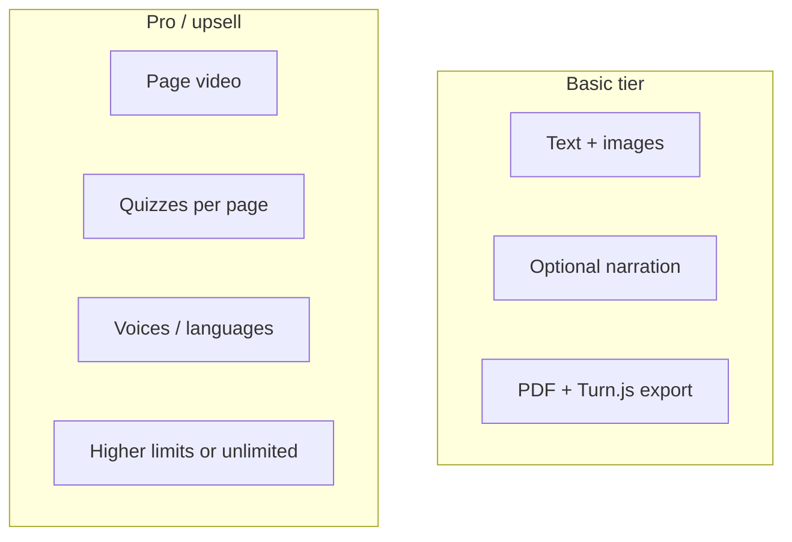

# AI Children’s Storybook App — Architecture Diagrams

This document matches exported **SVG** and **PNG** assets in [`diagrams/`](./diagrams/). The checked-in PNG/SVG were generated from the `.mmd` sources (see **Regenerating** below).

---

## 1. System architecture (Laravel + Inertia + Vue)





---

## 2. AI generation pipeline (async jobs)




---

## 3. User flow





---

## 4. Core domain (entities)





---

## 5. Feature tiers (positioning)





---

## Regenerating SVG and PNG

Edit the sources in `docs/diagrams/*.mmd`, then pick one approach.

### Option A — Kroki (no local install; needs network)

PowerShell from the repo root:

```powershell
$dir = "docs/diagrams"
$files = @('01-system-architecture','02-ai-pipeline','03-user-flow','04-domain-erd','05-feature-tiers')
foreach ($name in $files) {
  $path = Join-Path $dir "$name.mmd"
  $body = [System.IO.File]::ReadAllText((Join-Path (Get-Location) $path), [System.Text.Encoding]::UTF8)
  Invoke-RestMethod -Uri "https://kroki.io/mermaid/svg" -Method Post -Body $body -ContentType "text/plain; charset=utf-8" -OutFile (Join-Path $dir "$name.svg")
  Invoke-RestMethod -Uri "https://kroki.io/mermaid/png" -Method Post -Body $body -ContentType "text/plain; charset=utf-8" -OutFile (Join-Path $dir "$name.png")
}
```

### Option B — Mermaid CLI (local; uses Puppeteer/Chromium)

From `docs/diagrams` with Node.js:

```bash
npx --yes @mermaid-js/mermaid-cli@latest -i 01-system-architecture.mmd -o 01-system-architecture.svg
npx --yes @mermaid-js/mermaid-cli@latest -i 01-system-architecture.mmd -o 01-system-architecture.png
```

Repeat for each `*.mmd` file.
